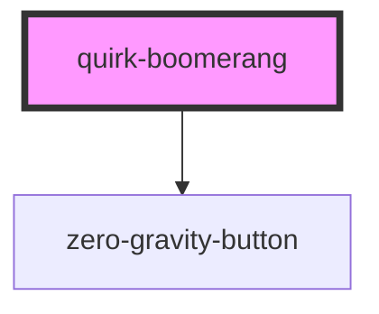

# quirk-boomerang

<!-- Auto Generated Below -->

## Properties

| Property        | Attribute        | Description | Type                                                                    | Default                                   |
| --------------- | ---------------- | ----------- | ----------------------------------------------------------------------- | ----------------------------------------- |
| `displayCount`  | `display-count`  |             | `number \| string \| { small: string; medium: string; large: string; }` | `{ small: "1", medium: "2", large: "4" }` |
| `moveCount`     | `move-count`     |             | `number`                                                                | `1`                                       |
| `totalElements` | `total-elements` |             | `number`                                                                | `0`                                       |

## Methods

### `moveQuirk() => Promise<void>`

#### Returns

Type: `Promise<void>`

## Dependencies

### Depends on

- [zero-gravity-button](../zero-gravity-button)

### Graph

----------------------------------------------

*Built with [StencilJS](https://stenciljs.com/)*
