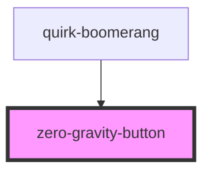

# zero-gravity-button

<!-- Auto Generated Below -->

## Properties

| Property         | Attribute         | Description | Type                                                                                                                                             | Default                                                   |
| ---------------- | ----------------- | ----------- | ------------------------------------------------------------------------------------------------------------------------------------------------ | --------------------------------------------------------- |
| `color`          | `color`           |             | `"primary" \| "secondary"`                                                                                                                       | `"primary"`                                               |
| `elevation`      | `elevation`       |             | `number`                                                                                                                                         | `2`                                                       |
| `hoverElevation` | `hover-elevation` |             | `number`                                                                                                                                         | `0`                                                       |
| `overlap`        | `overlap`         |             | `boolean`                                                                                                                                        | `false`                                                   |
| `position`       | `position`        |             | `"bottom-center" \| "bottom-left" \| "bottom-right" \| "center-left" \| "center-right" \| "custom" \| "top-center" \| "top-left" \| "top-right"` | `"custom"`                                                |
| `radius`         | `radius`          |             | `string`                                                                                                                                         | `this.variant.toLowerCase() === "round" ? "50%" : "26px"` |
| `ripple`         | `ripple`          |             | `boolean`                                                                                                                                        | `true`                                                    |
| `size`           | `size`            |             | `"large" \| "medium" \| "small"`                                                                                                                 | `"large"`                                                 |
| `variant`        | `variant`         |             | `"extended" \| "round"`                                                                                                                          | `"round"`                                                 |

## Dependencies

### Used by

 - [quirk-boomerang](../quirk-boomerang)

### Graph

----------------------------------------------

*Built with [StencilJS](https://stenciljs.com/)*
